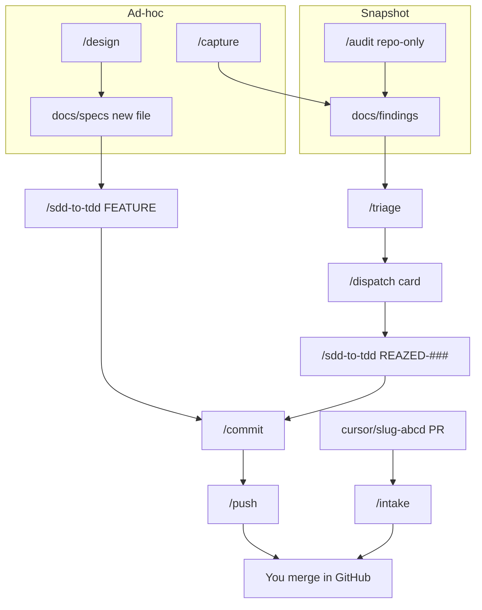

# Operator harness

Map of the Cursor command cycle in this folder. Command files under
[`commands/`](commands/) are the source of truth.

Work ships on the **`staging` accumulator** (feature PR = `<head> → staging`,
then promotion = `staging →` default branch). Agents never merge. You merge
in the GitHub UI. Linear **In Review** / **Done** are automation-owned.

Linear IDs are **`REAZED-###`**, team **Realized**, project
[restaurant-system](https://linear.app/realized/project/restaurant-system-a19062c2799e).
Specs live in [`docs/specs/`](../docs/specs/).

Vercel team **ralfcams-projects** (`team_MP13K4M0To2S4Duu2kknllAb`), git-linked
project **restaurant-system** (`prj_wFVDqQOtf6cjuUXscIoHDbtHzTTz`). Dashboard:
[ralfcams-projects/restaurant-system](https://vercel.com/ralfcams-projects/restaurant-system).
MCP namespace `plugin-vercel-vercel` (logs/deployments once `prj_` is known).
Env vars and `vercel link` are **CLI-only** — this MCP has no env tools.
`list_projects` on this MCP token may only return `syntex-global`; use
`.vercel/project.json` or the dashboard `prj_`. Runbook:
[`docs/runbooks/deploy.md`](../docs/runbooks/deploy.md). Rule:
[`rules/vercel-project.mdc`](rules/vercel-project.mdc).

**Plan Mode only:** [`/audit`](commands/audit.md), [`/triage`](commands/triage.md),
[`/dispatch`](commands/dispatch.md), [`/sdd-to-tdd`](commands/sdd-to-tdd.md),
[`/design`](commands/design.md).
[`/intake`](commands/intake.md) has no Plan Mode gate.

There is no GitHub QA workflow in this repo. Local gates are
`pnpm lint`, `pnpm typecheck`, and `pnpm test:unit`.

---

## Recommended cycle

`/audit` → `/triage` → `/dispatch` → (`/sdd-to-tdd` → `/commit` → `/push`)×N → you merge

- **Greenfield (no owning spec):** idea → [`/design`](commands/design.md) →
  new `docs/specs/<slug>.md` → `/sdd-to-tdd @<file>` FEATURE
- **Cloud Agent PR:** [`/intake`](commands/intake.md) for
  `cursor/<slug>-<4 hex>` heads. Run `/intake` **before** `/push` on the
  local lane when such a PR is open.

---

## Command map

| Command                                 | Job                                                                                 | Typical next                  |
| --------------------------------------- | ----------------------------------------------------------------------------------- | ----------------------------- |
| [`/audit`](commands/audit.md)           | Spec / test / tracking snapshot. PART 8 writes the ledger                           | `/triage`                     |
| [`/triage`](commands/triage.md)         | Groom Linear + ledger                                                               | `/dispatch`                   |
| [`/dispatch`](commands/dispatch.md)     | Split card: local Urgent/High on this `staging` checkout + 0–3 background worktrees | `/sdd-to-tdd REAZED-###`      |
| [`/design`](commands/design.md)         | Greenfield spec — hub walk, grill, one new spec file                                | `/sdd-to-tdd @<file>` FEATURE |
| [`/sdd-to-tdd`](commands/sdd-to-tdd.md) | Plan Mode, START, then Red → Green → Refactor                                       | `/commit`                     |
| [`/commit`](commands/commit.md)         | Lint + typecheck + unit + harness-lint, then commit. Never Linear writes            | `/push`                       |
| [`/push`](commands/push.md)             | Human heads (`sdd/REAZED-###` or `staging` promotion). Never merges                 | You merge                     |
| [`/intake`](commands/intake.md)         | Cloud `cursor/<slug>-<4 hex>` PRs. Isolated gates. Never merges                     | You merge                     |
| [`/capture`](commands/capture.md)       | Observation → ledger                                                                | `/triage`                     |
| [`/tldr`](commands/tldr.md)             | Recap a plan, chat, or `REAZED-###` (Ask Mode)                                      | —                             |
| [`/reflect`](commands/reflect.md)       | Re-check a thread’s claims against the tree                                         | —                             |

Helper: [`/reset-remote-db`](commands/reset-remote-db.md).

---

## Do not put on the loop

| Skip                                                                                              | Why                                         |
| ------------------------------------------------------------------------------------------------- | ------------------------------------------- |
| `/audit` after every ticket                                                                       | TDD + `/commit` already prove the criterion |
| `/dispatch` writing Linear, git, or starting TDD                                                  | The card is pasteable only                  |
| Background-dispatching auth / RLS / reservation or order status transitions / destructive deletes | Closed P0-surface list; those stay local    |
| `/intake` on a non-`cursor/` head                                                                 | Use `/push`                                 |
| `/push` while an OPEN `cursor/` PR exists                                                         | Intake first                                |
| Agent `gh pr merge` or Linear In Review / Done                                                    | You merge; automations own those states     |
| `/review` as a Linear Done gate                                                                   | Mode 1 file/plan revise only                |

---

## This folder

| Path                     | What                                      |
| ------------------------ | ----------------------------------------- |
| [`commands/`](commands/) | Slash-command orchestrators               |
| [`agents/`](agents/)     | Subagents (`spec-verifier`, `tdd-red`, …) |
| [`rules/`](rules/)       | Doctrine                                  |
| [`hooks/`](hooks/)       | Mechanical guards                         |
| [`checks/`](checks/)     | Harness lints and policy tests            |

## Next reading

- [`rules/staging-accumulator.mdc`](rules/staging-accumulator.mdc)
- [`rules/grilling.mdc`](rules/grilling.mdc)
- [`rules/linear-automation.mdc`](rules/linear-automation.mdc)
- [`docs/findings/README.md`](../docs/findings/README.md)
