# RES-68 resume — hide occupied tables from the assignment dropdown (C3, C5, C4)

## Execution Protocol (MANDATORY — read first when executing this plan)

You are the **orchestrator**, not an implementer. When this plan is executed:

- Your **only direct writes** are: (1) the **approved spec edit** under `docs/specs/**` (after operator yes), (2) the findings revision pass on `docs/findings/runs/<plan-slug>.md` after every phase (and, at close-out, the merge of its open lines into `docs/findings/<category>.md` + prune to `archive.md`), (3) appending Refactor close-out sections to `docs/verifier-reports/tdd/<plan-slug>.md` after each `tdd-refactor` phase, and (4) at close-out, **`## Suggested Review Order (collated)`** (Step 4D), **`## Traceability (final)`**, and **`## Run metrics`** (Step 4E) in the same tdd log. After a spec or living-findings (`docs/findings/<category>.md`) write, `pnpm exec prettier --write` **that file** (never `prettier --write .`). Snapshot trees (`docs/eval`, `docs/verifier-reports`, `docs/findings/runs`) are prettierignored. Everything else is delegated.
- **Every test change** comes from a `tdd-red` Task call. **Every source change** from `tdd-green`. **Every cleanup / re-verify** from `tdd-refactor`. Run them sequentially, one **phase** at a time, honoring each phase's exit condition before the next Task call.
- **Do not mark a phase done on subagent assertion alone** ([.cursor/rules/verification-before-completion.mdc](.cursor/rules/verification-before-completion.mdc)). The phase's own exit condition (the target test's actual pass/fail status) must be visible in the returned report.
- **One Task call per phase.** Do not satisfy a bundled "drive criterion X" todo by doing Red+Green+Refactor in one turn. If a phase lacks its own explicit entry, STOP and ask.
- **Never pass `model` on Task** for `tdd-red` / `tdd-green` / `tdd-refactor` / `docs-updater` / `linear-resolver`. Agent frontmatter owns the model (grok-4.7 after Prep step P2).
- You MUST NOT edit `tests/**`, `lib/**`, `app/**`, `components/**`, `hooks/**`, `src/**`, or `supabase/**` yourself. **Exception (mechanical only):** after close-out (docs-updater + 4C) and before STEP 4F, you MAY run `pnpm exec prettier --write` on paths already dirty from this run. Never `prettier --write .`.
- Docs sync = `docs-updater` (background). **Wait for its report in-thread** before 4C. After 4C/4B, run the format pass, then STEP 4G, then STEP 4F. Linear close-out (resolution comment only) and finding registration = `linear-resolver`. START is **skipped**: the `Work started:` comment already carries plan slug `res-68_hide_occupied_dropdown_a7c2e1f4`.
- **Close-out sequence (mandatory):** 4D → 4E → Docs sync packet → Step 4 (docs-updater) → 4C → 4B (FIX) → format pass (`pnpm exec prettier --write` on this run's dirty paths from `git status --porcelain`; never `.`) → STEP 4G (mandatory advisory local CodeRabbit attempt; ignored audit receipt; never written into the tdd log) → STEP 4F (local: point operator to `/commit`). After each Refactor phase, append that criterion's `Suggested review order:` and `Reusable pattern:` lines to `docs/verifier-reports/tdd/<plan-slug>.md`. Treat a bare "none" in Refactor's `## Residual findings` as suspect.
- **Out-of-scope findings are tracked in the run file, merged to the bus at close-out, never dropped or chased.** Run a revision pass on `docs/findings/runs/<plan-slug>.md` immediately after each phase (remove resolved, dedupe/sharpen, append genuinely new, re-home).
- **A skipped test is not progress** ([.cursor/rules/test-execution-integrity.mdc](.cursor/rules/test-execution-integrity.mdc)). All criteria are unit (no infra); 0 tests collected = BLOCKED.
- If you cannot delegate (Task unavailable or model quota-blocked), STOP and report — do not self-implement.
- Arm the delegation guard first (`node .cursor/hooks/tdd-guard.mjs on`), set `phase red|green|refactor` before each phase Task, `phase clear` after each criterion's Refactor, and `off` as the last action.

`<plan-slug>` = `res-68_hide_occupied_dropdown_a7c2e1f4` (reused so the existing tdd log and findings run file continue).

## Mode Check

- Plan Mode: YES (proceeding)
- Cloud runtime: n/a (Plan Mode)
- Work-order: n/a (native plan); the branch copy `.cursor/plans/res-68_hide_occupied_dropdown_a7c2e1f4.plan.md` is refreshed in Prep P4
- Workflow mode: FIX (resume)

## Project & Milestone Route

- Team: `RES`
- Project/milestone: existing RES-68 placement (validated in the prior run); work type implementation → M4
- Mixed design + implementation: no
- Clarification: none (operator chose: publish staging, merge into PR branch; add C5)

## Issue & Root Cause

- Issue: [RES-68](https://linear.app/realized/issue/RES-68/hide-occupied-tables-from-the-reservation-table-assignment-dropdown) / [PR #133](https://github.com/ralfcam/restaurant-system/pull/133) (draft). Observed: Table 8, held by an overlapping Seated reservation, is still offered in another reservation's dropdown. Expected: it is omitted.
- Root cause (encoded as FP-5-DROPDOWN-OCCUPANCY in `docs/specs/scheduling.md`, shipped on the branch): the dropdown filters stale `tables.status` instead of BW-9/BW-10 occupying windows.
- State on branch (`08df122`, `5b5cf84`): C1 and C2 are green in [lib/reservations/selectable-tables.ts](lib/reservations/selectable-tables.ts). C3 and C4 are blocked (the `tdd-red` model was over quota). [components/staff/reservations-manager.tsx](components/staff/reservations-manager.tsx) `TableAssignment` still calls the helper with 3 args, so the live UI bug remains.
- CodeRabbit (4 Major, all routed here): (a) C3 floor gate `table.status === "available"`; (b) C4 live wiring missing; (c) the C4 source-scan test is replaced by a rendered-options behavior test; (d) the hardcoded 90+15 window becomes C5.

```mermaid
flowchart LR
  page["app/admin/reservations/page.tsx"] -->|"occupancyWindow (C5)"| manager[ReservationsManager]
  manager -->|"reservations state + occupancyWindow (C4)"| ta[TableAssignment]
  ta -->|"bag: candidate, occupying, minutes"| helper[selectableTablesForAssignment]
  helper -->|"C3: drop floor-available gate"| options[dropdownOptions]
```



## Prep (operator/git, before any TDD phase)

- **P1** — On local `staging`: `git pull --rebase origin staging` (local is 2 behind `origin/staging`: `9578bb1`, `3d65eb4`), then publish `777931d` (agent model pins to grok-4.7 + findings reshuffle) via `/push` on the staging local lane.
- **P2** — `git switch cursor/res-68-hide-occupied-tables-855f`; `git merge origin/staging`. Verify `.cursor/agents/tdd-red.md` reads `model: grok-4.7[...]`. If the merge conflicts outside `.cursor/agents` / `docs/findings`, STOP.
- **P3** — Baseline: `pnpm test:unit tests/unit/reservations/selectable-tables.test.ts` (3 pass) before C3 Red.
- **P4** — Replace the branch work-order body `.cursor/plans/res-68_hide_occupied_dropdown_a7c2e1f4.plan.md` with this approved plan (clears CodeRabbit's C4 source-scan comment).

## Spec

- Source: extend existing `docs/specs/scheduling.md` FP-5 / **FP-5-DROPDOWN-OCCUPANCY** (already on branch).
- Summary: the dropdown omits labels claimed by overlapping `confirmed`/`seated` same-date reservations (BW-9/BW-10). It keeps the candidate's own label. Floor status is not occupancy (except `out_of_service`). Non-overlapping reuse is allowed. It recomputes from the in-memory reservation list without a refetch or reload.
- Proposed sharpening (one clause, needs your yes): after "whose BW-9 occupying window overlaps the candidate", insert "— computed from the restaurant-wide `restaurant_settings.occupancy_duration_minutes` + `safety_buffer_minutes` (the same clamped values `assignReservationTable` uses), not the 90 + 15 defaults unless the settings row is absent". Stamp Last updated 2026-09-23.
- Clarifications needed: none.

## Acceptance Criteria → Tests

- **C3** — Non-overlapping reuse; floor status is not occupancy. Risk P1. Layer unit. File `tests/unit/reservations/selectable-tables.test.ts` (existing, add test). Test `includes a table claimed only by a non-overlapping occupying reservation`. Assertion: Table 8 (floor `status: "seated"`, only claim is 12:00 seated) is offered to a 19:00 same-date candidate. A floor-`reserved`/`cleaning` free table fitting seats is offered. An `out_of_service` table is still omitted. Command `pnpm test:unit tests/unit/reservations/selectable-tables.test.ts`. Depends on C1.
- **C5** — Occupancy window uses configured duration + buffer. Risk P1. Layer unit. Same file (add test). Test `uses the configured occupancy duration and safety buffer for occupying windows`. Assertion: with bag `occupancyDurationMinutes: 135, safetyBufferMinutes: 15`, a 10:00 seated claim on Table 8 overlaps a 12:00 candidate, so Table 8 is omitted (with the 90+15 defaults it would be offered). Omitting the minutes falls back to the defaults. Same command. Depends on C1.
- **C4** — Live dropdown recomputes from in-memory reservations. Risk P1. Layer unit (rendered markup). New file `tests/unit/components/staff/table-assignment.test.ts` (`.ts`, because the unit config only includes `*.test.ts`; use `createElement` + `react-dom/server` `renderToStaticMarkup`; `vi.mock("@/app/actions/reservations")` and `next/navigation`). Test `table assignment dropdown options follow the in-memory reservation list`. Assertion: render exported `TableAssignment` for candidate B (12:00, unassigned) with `reservations` = [A seated Table 8 12:00, B]; the markup has no `value="8"` option. Re-render with A `status: "completed"`; the option is present. Re-render with A `tableLabel` cleared (unassign); the option is present. `getReservationTables` mock is not called by the render. Command `pnpm test:unit tests/unit/components/staff/table-assignment.test.ts`. Depends on C3, C5.
- Why unit for C4: e2e has only smoke/localization specs and no seeded reservations persona. Rendering the real component against two in-memory lists proves the options derive from the list that `assignTable`/`updateStatus` already mutate. A full click-through remains a manual check on the Vercel preview (see Manual-UAT).
- Order: C3 → C5 → C4 (both helper criteria before wiring).

## Traceability Matrix

- C1 · FP-5-DROPDOWN-OCCUPANCY · selectable-tables.test.ts::omits a table claimed by an overlapping seated or confirmed reservation · lib/reservations/selectable-tables.ts · P1 · shipped (prior run)
- C2 · same · selectable-tables.test.ts::keeps the reservation current label when that table is occupying · lib/reservations/selectable-tables.ts · P1 · shipped (prior run)
- C3 · same · selectable-tables.test.ts::includes a table claimed only by a non-overlapping occupying reservation · selectable-tables.ts (Green) · P1 · planned
- C5 · same + scheduling FP-3 BW-9 · selectable-tables.test.ts::uses the configured occupancy duration and safety buffer… · selectable-tables.ts, app/admin/reservations/page.tsx, app/actions/reservations.ts (Green) · P1 · planned
- C4 · same · table-assignment.test.ts::table assignment dropdown options follow the in-memory reservation list · components/staff/reservations-manager.tsx (Green) · P1 · planned

## Execution Preconditions

- Infra: none (all unit/mocked). Prep P1–P3 must be complete (model pins present on the PR branch).
- If `tdd-red` is quota-blocked again: STOP (do not override `model`).

## Permissions Requested (before execution)

- Spec edit: `docs/specs/scheduling.md` — the one-clause configured-settings sharpening of FP-5-DROPDOWN-OCCUPANCY (above).
- Work-order refresh: `.cursor/plans/res-68_hide_occupied_dropdown_a7c2e1f4.plan.md` (Prep P4).
- Existing-test edit: none (C3/C5 add tests to the existing file; C4 is a new file).

## TDD Execution Loop

### Criterion C3 — non-overlapping reuse; floor status is not occupancy (layer: unit)

- **Red** → Use the `tdd-red` subagent to add `it("includes a table claimed only by a non-overlapping occupying reservation")` to `tests/unit/reservations/selectable-tables.test.ts` (floor-`seated` Table 8 with a non-overlapping claim offered; free floor-`reserved`/`cleaning` offered; `out_of_service` omitted). It must fail on the current `table.status === "available"` gate, run executed via `pnpm test:unit tests/unit/reservations/selectable-tables.test.ts`. tests/** only.
- **Green** → Use the `tdd-green` subagent to change the predicate in `selectableTablesForAssignment` to `table.status !== "out_of_service" && table.seats >= partySize` (current-label keep and claimed omit unchanged). Exit: target test green (executed), existing 3 tests green, typecheck clean.
- **Refactor** → Use the `tdd-refactor` subagent to clean C3 (update the JSDoc that says "available tables"); exit green + `pnpm lint` + `pnpm typecheck` + `pnpm exec prettier --check lib/reservations/selectable-tables.ts`.

### Criterion C5 — configured BW-9 duration and buffer (layer: unit)

- **Red** → Use the `tdd-red` subagent to add `it("uses the configured occupancy duration and safety buffer for occupying windows")` to the same file (135+15 bag: 10:00 claim hides Table 8 for 12:00; bag without minutes keeps the 90+15 default behavior). It must fail because the helper ignores bag minutes. Same command.
- **Green** → Use the `tdd-green` subagent to add optional `occupancyDurationMinutes` / `safetyBufferMinutes` to `OccupancyBag` and use them (defaulting to `DEFAULT_EXPECTED_MINUTES` / `DEFAULT_SAFETY_BUFFER_MINUTES`) for both windows in `claimedOccupyingLabels`. Also add a staff-gated `getReservationOccupancyWindow()` in `app/actions/reservations.ts` that reuses the same `restaurant_settings` read + `occupancyDurationFromSettings` / `clampSafetyBufferMinutes` as `assignReservationTable` (extract one shared helper; no third copy). Load it in `app/admin/reservations/page.tsx` and pass `occupancyWindow` as a **required** prop to `ReservationsManager`, so typecheck guards the page hop. Exit: target test green, typecheck clean.
- **Refactor** → Use the `tdd-refactor` subagent to clean C5 (ensure `assignReservationTable` and the new loader share one settings helper); exit green on `tests/unit/reservations/selectable-tables.test.ts` + the assign-table unit tests, lint, typecheck, prettier --check on touched source.

### Criterion C4 — live dropdown follows in-memory reservations (layer: unit, rendered)

- **Red** → Use the `tdd-red` subagent to create `tests/unit/components/staff/table-assignment.test.ts`: `renderToStaticMarkup(createElement(TableAssignment, …))` with mocked `@/app/actions/reservations` and `next/navigation`. Cases: Table 8 omitted while A is seated and overlapping; present after A becomes `completed`; present after A is unassigned; `getReservationTables` not called. It must fail (today `TableAssignment` is not exported, takes no `reservations`/`occupancyWindow`, and passes 3 args). Command `pnpm test:unit tests/unit/components/staff/table-assignment.test.ts`.
- **Green** → Use the `tdd-green` subagent to export `TableAssignment`, add `reservations` + `occupancyWindow` props, build the bag from the in-memory `Reservation[]` (UI camelCase → `AssignableReservation` pick: `id, date, time, status, table_label`) and pass it as the 4th arg. In `ReservationsManager`, pass `reservations={reservations}` and `occupancyWindow`. No new fetch or `router.refresh()` for occupancy. Exit: target test green, selectable-tables tests green, typecheck clean.
- **Refactor** → Use the `tdd-refactor` subagent to clean C4 and re-verify the whole relevant suite (`pnpm test:unit` full), lint, typecheck, prettier --check on touched source.

## Manual-UAT (deferred, not automated)

- Preview click-through: seat A at Table 8 12:00; B's (12:00) dropdown omits Table 8; complete A; Table 8 reappears without reload. Rendered unit test covers the logic; this is a confidence check on the Vercel preview, not an AC.

## Linear Plan Digest

START skipped — the `Work started:` comment already carries `res-68_hide_occupied_dropdown_a7c2e1f4`. No new digest is posted.

## Docs Sync

Close-out todos: `4d-review-trail`, `4e-traceability`, `4-docs-packet`, `4-docs-updater`, `4c-findings`, `4b-linear`, `4-format`, then STEP 4G, then STEP 4F (`/commit` with `Fixes RES-68`, then `/push`; rename the PR title from `wip(...)` to `fix(RES-68): hide occupied tables from assignment dropdown` per CodeRabbit's title check).

```markdown
## Docs sync packet

- plan_slug: res-68_hide_occupied_dropdown_a7c2e1f4
- spec: docs/specs/scheduling.md
- mode: FIX
- linear_issue: RES-68
- criteria_shipped: [C1, C2, C3, C5, C4]
- criteria_manual_uat: none
- req_ids: [FP-5, FP-5-DROPDOWN-OCCUPANCY]
- source_paths: [lib/reservations/selectable-tables.ts, components/staff/reservations-manager.tsx, app/admin/reservations/page.tsx, app/actions/reservations.ts]
- test_paths: [tests/unit/reservations/selectable-tables.test.ts, tests/unit/components/staff/table-assignment.test.ts]
- architecture_touch: [Floor-Plan]
- uat_flows_to_stamp: none
- patterns_to_promote: <from tdd log>
- traceability_log: docs/verifier-reports/tdd/res-68_hide_occupied_dropdown_a7c2e1f4.md
- drift_flagged: none
- skip_reason: none
```

The FP-5 implementation-map row in `scheduling.md` needs the 4-arg call + settings loader noted (docs-updater).

## Out-of-Scope Findings (existing run file — carried forward)

- `no_show` still enabled on the Table assignment select · `reservations-manager.tsx` TableAssignment · med · deferred
- Floor status chrome ("· seated") still painted on selectable options · same · low
- Occupying-window scan duplicated across helper / write path / `planAutoAssignments` · low
- Dual self keys (`currentLabel` vs `candidate.id`) · low
- Test-debt: C1 closed-status/other-date cases, C2 own-confirmed, C2 title vs skip-own-id · low
- **Resolved in-run (remove from the run file after C5 Green):** "Dropdown occupancy uses hardcoded 90+15".

## Linear Close-out & Findings Registration

- START: skip (already posted).
- 4C: merge run file → `docs/findings/<category>.md`; `linear-resolver` applies the Issue-filing policy (floor, attach-over-create, cap 3), with your confirmation for net-new issues; prune only filed/attached to `archive.md`; delete the run file.
- 4B: `linear-resolver` posts the resolution comment on RES-68 (root cause, spec clause, tests, source files, verification, spun-off IDs). No state write.

## Suggested Review Order (assembled at 4D)

- occupancy predicate + configured window → `lib/reservations/selectable-tables.ts`
- settings loader shared with write path → `app/actions/reservations.ts`
- live wiring → `components/staff/reservations-manager.tsx` TableAssignment, `app/admin/reservations/page.tsx`
- tests → `selectable-tables.test.ts`, `table-assignment.test.ts`

## Retrospective (4E)

- Patterns: from tdd log. Traceability (final) + Run metrics: pending. `node .cursor/checks/harness-lint.mjs res-68_hide_occupied_dropdown_a7c2e1f4`: pending.

## First Execution Action

Prep P1 (rebase local staging and publish `777931d` via `/push`), then P2 merge into the PR branch, P3 baseline, P4 work-order refresh. Then request your yes on the spec clause, apply it, and invoke the `tdd-red` subagent for C3.
