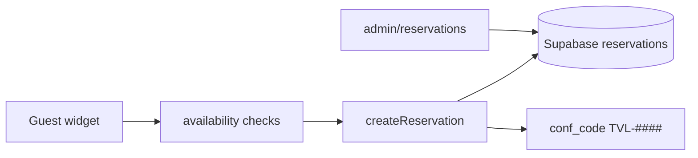

# Reservation flow

**Status:** Reference  
**Last updated:** 2026-06-27

Summary of guest booking — criteria live in [../specs/booking-rules.md](../specs/booking-rules.md).

Key modules: `components/site/reservation-widget.tsx`, `app/actions/reservations.ts`,
`app/actions/availability.ts`.
