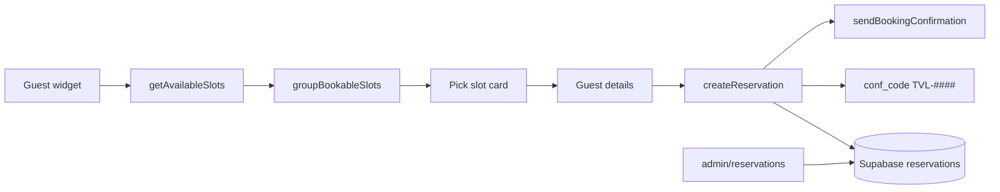

# Reservation flow

**Status:** Reference  
**Last updated:** 2026-09-25

Summary of guest booking — criteria live in [../specs/booking-rules.md](../specs/booking-rules.md)
(BW-1…BW-22 for the segmented homepage widget, occupancy window,
compatible-table bookability, slot/service cover caps, last-slot fully booked
in-widget reject, collapsed accordion label/summary gap, guest email intake,
and post-booking confirmation).

```mermaid
flowchart LR
  Guest[Guest widget] --> Slots[getAvailableSlots]
  Slots --> Group[groupBookableSlots]
  Group --> Pick[Pick slot card]
  Pick --> Details[Guest details]
  Details --> Create[createReservation]
  Create --> DB[(Supabase reservations)]
  Create --> Code[conf_code TVL-####]
  Create --> Confirm[sendBookingConfirmation]
  Admin[admin/reservations] --> DB
```

**Segmented widget.** Staff opening-hour segments (`operating_windows` on
`/admin/scheduling`) drive grouped slot cards. `getAvailableSlots` reads
`restaurant_settings.slot_interval_minutes` from `/admin/floor`, clamps via
`clampSlotIntervalMinutes`, and passes the step into `bookableTimesForDay`.
`groupBookableSlots` assigns each time to one segment (BW-1), attaches optional
`guest_note` (inherits scheduling §13 OH-NOTE-SAVE; the widget does not
truncate), and renders until-badges via
`slotUntilTime(time, occupancyDurationMinutes)` (occupancy duration from
`getGuestOccupancyDurationMinutes`, default 90; wraps past midnight; no
safety buffer). Guests/date/time are exclusive accordions; collapsed chrome labels stay
separated from their summaries by an unprefixed `accordionTriggerCls` `gap-1.5`
(BW-17). Réserver advances
to guest details only after a slot is selected (no `createReservation` on pick).
Step 2 requires guest name and a valid email; phone is optional (BW-7 / BW-13).
When `createReservation` returns `Booking denied: This time is fully booked.`,
step 2 stays visible and renders that string in-widget (`role="alert"`); this
path does not toast or change step, and does not clear guest name / email / phone
(BW-16). Step-2 Back calls `setFullyBookedError(null)` with `setStep(1)` /
`setSlot(null)` so the denial is attempt-scoped. Other confirm errors keep their
existing toasts.
After INSERT succeeds, `createReservation` calls `sendBookingConfirmation` from
the in-memory payload (no `.select()` of the inserted row). A throwing mailer
is caught; `conf_code` is still returned (AC-4 / BW-14). Live provider stays
manual-UAT. `conf_code` uniqueness is database-enforced:
`CREATE UNIQUE INDEX IF NOT EXISTS reservations_conf_code_uidx ON public.reservations (conf_code)`
immediately after the `reservations` table create in
`supabase/migrations/00000000000000_baseline.sql`. Guest INSERT still includes
`conf_code`; `createReservation` 23505 retry is unchanged.

**Occupancy window.** `confirmed` and `seated` occupy covers on
`[start, nextBookableTime(start))` (occupancy + staff-manageable buffer,
defaults 90 + 15). `getAvailableSlots` `normalizeTime`s reservation `time`
before comparing to generated `HH:MM` slots, then ANDs cover-count with
`canSeatPartyOnTables` (BW-12). The confirm path uses the same half-open
window in `validate_reservation_availability` (`SECURITY DEFINER`; same-date
elapsed `TIME`; table-fit after cover-count; date-scoped
`pg_advisory_xact_lock(305, days-since-epoch)`; P0001
`Booking denied: This time is fully booked.`). Last-writer body is
byte-identical in baseline, `20260818162000_operating_hour_segments.sql`,
`20260827180000_occupancy_duration_buffer.sql`,
`20260828121224_table_fit_availability.sql`, and
`20260918140655_slot_service_cover_limits.sql`. Guest INSERT does not write
`table_label`. `completed` / `cancelled` / `no_show` do not occupy (BW-10).
Criteria: [../specs/booking-rules.md](../specs/booking-rules.md) BW-9–BW-12.

**Slot and service cover caps.** Optional `operating_windows.max_covers`
(`INT NULL`, `CHECK (max_covers IS NULL OR max_covers >= 1)`) and
`bookable_slots` JSONB (`NOT NULL DEFAULT '[]'`; empty = all generated times;
non-empty = exclusive allowlist on the interval grid in `[opens_at, closes_at)`)
are the BW-18 / BW-19 caps. `getAvailableSlots` keeps BW-18 occupying covers in
`occupyingCoversByExactTime` (not BW-9 `bookedBySlot`) and BW-19 by
`sort_order` + `opens_at`, then ANDs `coversFitSlotAndService` with BW-9 /
BW-12 (`available: slotAndServiceFit && coversFit && tableFit`, BW-22).
The helper is occupancy-sum only; the caller supplies exact-time slot and
all-day service sums. Confirm-path BW-20 is the same predicates in
`validate_reservation_availability` after lock + inventory + table-fit
(same P0001). Staff `validateOperatingDays` gates CL-1–CL-3;
`replace_operating_windows` INSERTs both columns. Staff Save
`flattenDaysToRows` / `toOperatingDays` and guest `WINDOW_COLUMNS` round-trip
them so `getOperatingWindowForDate` sees persisted caps. The
`/admin/scheduling` Save preview in `SchedulingManager` takes
`slotIntervalMinutes` from the scheduling page (absent/null settings → 30).
Criteria:
[../specs/booking-rules.md](../specs/booking-rules.md) BW-18–BW-22 and
[../specs/scheduling.md](../specs/scheduling.md) CL-1–CL-4.

**Blocked-date reads.** `isDateBlocked`, `getBlockedDatesInMonth`, and
`getBlockedDatesInRange` in `app/actions/availability.ts` query `blocked_dates`
on the anon client. A non-null SELECT `error` is logged server-side and thrown as
`Error("Could not load blocked dates.")` — they do not resolve `false` or `[]`.
Successful empty/null data is unchanged (`isDateBlocked` is `false` with no row;
list readers return `[]` only then). Caller recovery UI is out of scope.
Criterion: [../specs/booking-rules.md](../specs/booking-rules.md) BD-READ-FAIL.

**Post-visit review email.** `transitionReservationStatus` to `completed`
stamps `completed_at` and inserts `review_email_sends` (both in baseline;
nullable `reservations.email` unchanged). Staff configure send on
`/admin/marketing`. Hourly Supabase `pg_cron` invokes Edge Function
`review-email`, which GETs `/api/cron/review-email` with
`createReviewEmailMailer()`. Spec:
[../specs/post-visit-review-email.md](../specs/post-visit-review-email.md).

**Staff analytics.** `/admin/analytics` is a read-only aggregator
(`getReservationAnalytics`). Criteria:
[../specs/reservation-analytics.md](../specs/reservation-analytics.md).

**Staff inquiries.** `/admin/inquiries` is a sibling ledger under Service
next to `/admin/reservations` (`StaffShell` NAV `href` and Service
`NAV_GROUPS`). Rows persist on `event_inquiries`, never occupy covers,
never mint `conf_code`, and never appear in RA-7 analytics. There is no
convert/confirm action. Chrome is list-only (name / requested date /
party / status); create and status-update are staff server actions
without forms. Default list is `open`+`contacted`. Spec:
[../specs/event-inquiries.md](../specs/event-inquiries.md).

Key modules: `components/site/reservation-widget.tsx`,
`lib/reservations/operating-hours.ts`, `lib/reservations/auto-assign.ts`,
`lib/reservations/validation.ts`, `lib/marketing/booking-confirmation.ts`,
`lib/marketing/review-email.ts`, `lib/marketing/review-email-mailer.ts`,
`app/actions/reservations.ts`, `app/actions/availability.ts`.
