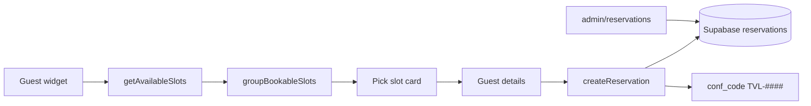

# Reservation flow

**Status:** Reference  
**Last updated:** 2026-08-27

Summary of guest booking — criteria live in [../specs/booking-rules.md](../specs/booking-rules.md)
(BW-1…BW-11 for the segmented homepage widget and occupancy window).

```mermaid
flowchart LR
  Guest[Guest widget] --> Slots[getAvailableSlots]
  Slots --> Group[groupBookableSlots]
  Group --> Pick[Pick slot card]
  Pick --> Details[Guest details]
  Details --> Create[createReservation]
  Create --> DB[(Supabase reservations)]
  Create --> Code[conf_code TVL-####]
  Admin[admin/reservations] --> DB
```

**Segmented widget.** Staff opening-hour segments (`operating_windows` on
`/admin/scheduling`) drive grouped slot cards. `getAvailableSlots` reads
`restaurant_settings.slot_interval_minutes` from `/admin/floor`, clamps via
`clampSlotIntervalMinutes`, and passes the step into `bookableTimesForDay`.
`groupBookableSlots` assigns each time to one segment (BW-1), attaches optional
`guest_note`, and renders until-badges via
`slotUntilTime(time, occupancyDurationMinutes)` (occupancy duration from
`getGuestOccupancyDurationMinutes`, default 90; wraps past midnight; no
safety buffer). Guests/date/time are exclusive accordions; Réserver advances
to guest details only after a slot is selected (no `createReservation` on pick).

**Occupancy window.** `confirmed` and `seated` occupy covers on
`[start, nextBookableTime(start))` (occupancy + staff-manageable buffer,
defaults 90 + 15). `getAvailableSlots` `normalizeTime`s reservation `time`
before comparing to generated `HH:MM` slots. The confirm path uses the same
half-open window in `validate_reservation_availability` (`SECURITY DEFINER`;
same-date elapsed `TIME`; P0001 `Booking denied: This time is fully booked.`).
`completed` / `cancelled` / `no_show` do not occupy (BW-10). Criteria:
[../specs/booking-rules.md](../specs/booking-rules.md) BW-9–BW-11.

Key modules: `components/site/reservation-widget.tsx`,
`lib/reservations/operating-hours.ts`, `app/actions/reservations.ts`,
`app/actions/availability.ts`.
